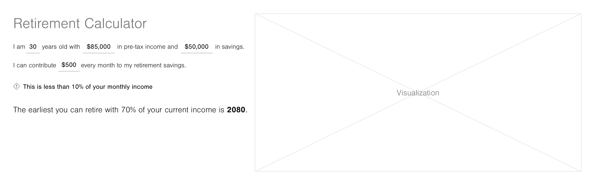

# Hello!

:wave:

Thank you for taking the time and energy to do this test project. We look forward to seeing what you do!

We generally encourage doing this at home or other comfortable environments. If you prefer we can also work on it together in a screen sharing session or a visit to Vestwell’s office.

_Jump to…_

- [Requirements](#requirements)
- [API](#api)
- [Next Steps](#next-steps)

## Requirements

Implement a frontend for an API that returns a projection of retirement savings.

It should look and function like this mockup:

<table>
  <tr>
    <td>
      
    </td>
  </tr>
</table>

[Inspect Mockup with Abstract][abstract]

Your solution need not match this in appearance — iterate the details as you see fit. Only the content and layout should remain the same.

### Expectations

Try to spend no more than **2 hours** on your solution. To help save time we have bootstrapped this repository with [Create React App][cra]. With this foundation in place you should focus on implementing:

- HTML markup
- CSS to achieve the target layout
- React components and wiring
- XHR request to the API
- Visualization of results, can be as simple as a list or table

Please create one or more test files with [TODOs][jest-todos] that outline _what_ you would test. It is not necessary to write actual tests.

:grimacing:

If you can’t complete everything that is OK! We prefer to see a partial solution that you are proud of vs. spending lots of time to finish. We recommend documenting a list of TODOs for any remaining items you would address with more time.

#### Some details we care about…

- Accessibility of HTML
- Quality of commit messages
- Quantity of commits
- Code readability
- Consistency of code style
- Tabs or spaces!

### Alternative Frameworks

Haven’t used React before or would prefer to implement your solution using an alternate framework? Please feel free to replace the creact-react-app boilerplate with something comparable for Vue, Ember, Svelte, Angular, etc. or even start from scratch. React projects will be easier for us to review and it is the framework of choice at Vestwell. But we understand it isn’t the only option, and respect that. 

## API

##### Base URL

`https://naosxd9a48.execute-api.us-east-2.amazonaws.com/hiring`

##### API Key

`x-api-key` `8FbZ6sdhIf6yEPWVM1Sw56Km5G1GXwKL73CvWzWv`

#### POST `/calculate`

Calculates projected retirement savings given some inputs and assumptions. Compounds interest annually. Returns savings by year with a breakdown of:

- Current available monthly income from savings, assuming max. life expectancy
- Balance of contributions
- Accumulated interest
- Monthly income required for 70% of current income

_Assumptions_

- Life expectancy of 95
- Interest rate of 5%
- 70% of current income

##### Request Payload

- `age` Current age · _integer_
- `contribution` Monthly contribution · _integer_
- `income` Current annual income · _integer_
- `savings` Current savings · _integer_

##### Response

```json
{
  "data": [
    {
      "availableMonthlyIncome": 59.32,
      "balance": 42000,
      "interest": 17098.22,
      "minimumMonthlyIncome": 4958.33,
      "year": 2025
    },
    {
      "availableMonthlyIncome": 68.97,
      "balance": 48000,
      "interest": 22917.86,
      "minimumMonthlyIncome": 4958.33,
      "year": 2026
    }
  ]
}
```

## Next Steps

:raised_hands:

Please open a pull request to this repo once your solution is ready for review. Include any notes, TODOs, etc. you would like to share in the description.

:clock1:

We’ll be in touch within 1 business day to schedule a followup interview. We will review the project and talk further. We may leave some comments and/or clarifying questions on the PR in the interim.

Thank you again!

[cra]: https://github.com/facebook/create-react-app
[jest-todos]: https://jestjs.io/docs/en/api#testtodoname
[abstract]: https://share.goabstract.com/0f84b757-7b8f-4e6a-a415-829f205342c8
